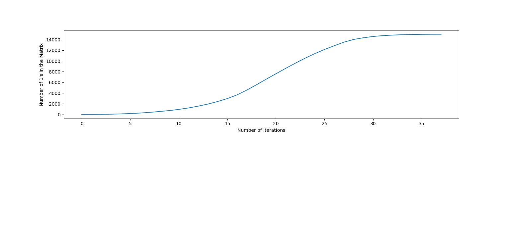
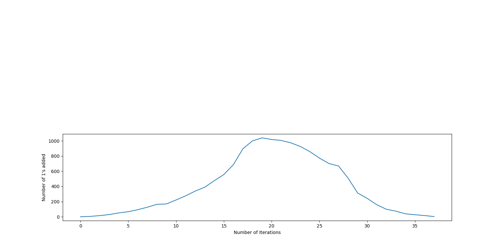

# Basic VIRUS Simulation 

This Assignment of MOODIFY-learning is based on a basic Virus spread simulator. We have taken a grid(a 2D np array) of dimension 100 x 150 and each block represents a person that means there are a total of 15000 people and the simulation stops when all the people are infected. 
Value 0 means not affected and 1 means affected by the virus. Also the people randomly travel which is simulated as swapping of values randomly in each iteration. 
each iteration includes 
- travelling of people
- effect on first and second neighbours 
- and then we store the statistics

In this project I have used modules like numpy, matplotlib and random 
```bash
pip install matplotlib
```
```bash
pip install numpy
```
simple functions like the following have been used 
#### 1) travel() - which simulates the swapping of values on random basis 
#### 2) effecton_neigh1() and effecton_neigh2()- as their name suggests they simulate the effect on the first and second neighbours of an affected person. A person who is a first          neighbour of an infected person has a 25% chance of contracting the virus while a second neighbour has a 0.08 % chance of contracting it. 
The project also includes conlusion based on few graphs that have been plotted based on the information we get from the simulation 
####   1) One graph is the plot between the number of infected people v/s no. of iterations 

####   2) Other graph is a plot of number of infected people added in each iteration v/s no. of iterations

From the above plots we get to know that maximum number of infected people added in a single iteration is 1039
       

